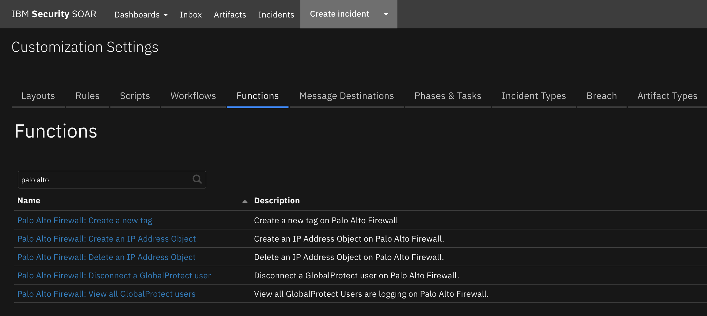
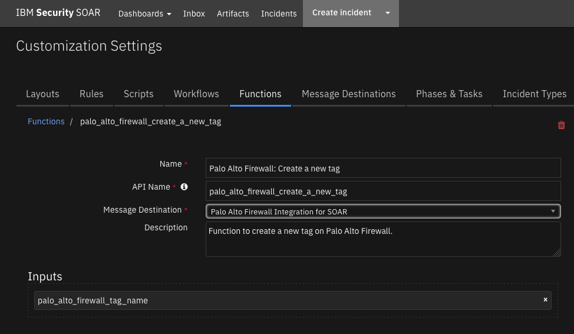
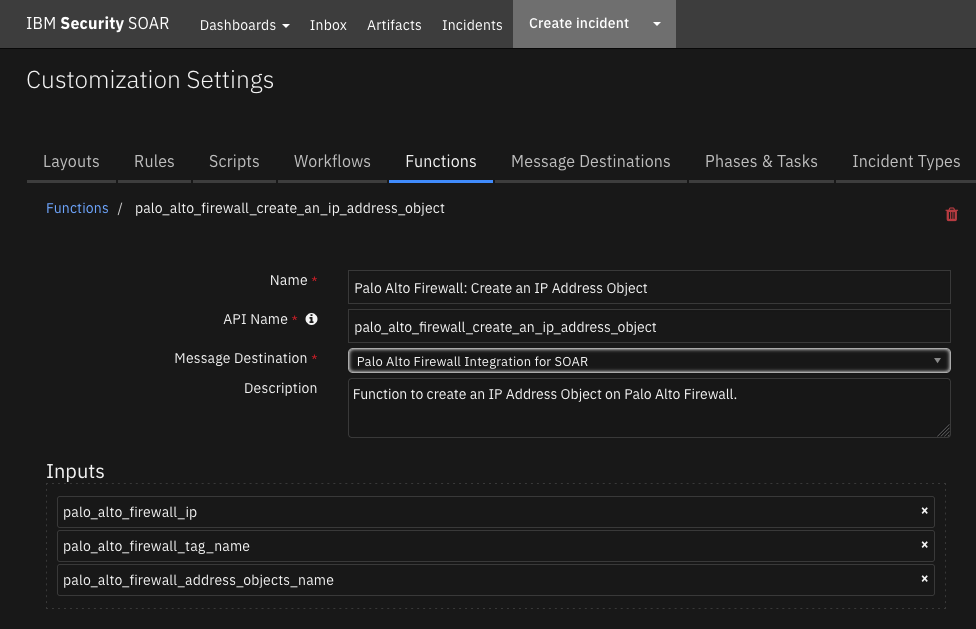

<!--
  This README.md is generated by running:
  "resilient-sdk docgen -p fn_pa_firewall"

  This file was generated with resilient-sdk v48.0.4034

  It is best edited using a Text Editor with a Markdown Previewer. VS Code
  is a good example. Checkout https://guides.github.com/features/mastering-markdown/
  for tips on writing with Markdown

  All fields followed by "::CHANGE_ME::"" should be manually edited

  If you make manual edits and run docgen again, a .bak file will be created

  Store any screenshots in the "doc/screenshots" directory and reference them like:
  

  NOTE: If your app is available in the container-format only, there is no need to mention the integration server in this readme.
-->

# Palo Alto Firewall

## Table of Contents
- [Release Notes](#release-notes)
- [Overview](#overview)
  - [Key Features](#key-features)
- [Requirements](#requirements)
  - [SOAR platform](#soar-platform)
  - [Cloud Pak for Security](#cloud-pak-for-security)
  - [Proxy Server](#proxy-server)
  - [Python Environment](#python-environment)
- [Installation](#installation)
  - [Install](#install)
  - [App Configuration](#app-configuration)
- [Function - Palo Alto Firewall: Create a new tag](#function---palo-alto-firewall-create-a-new-tag)
- [Function - Palo Alto Firewall: Create an IP Address Object](#function---palo-alto-firewall-create-an-ip-address-object)
- [Function - Palo Alto Firewall: Delete an IP Address Object](#function---palo-alto-firewall-delete-an-ip-address-object)
- [Function - Palo Alto Firewall: Disconnect a GlobalProtect user](#function---palo-alto-firewall-disconnect-a-globalprotect-user)
- [Function - Palo Alto Firewall: View all GlobalProtect users](#function---palo-alto-firewall-view-all-globalprotect-users)
- [Rules](#rules)
- [Troubleshooting & Support](#troubleshooting--support)

---

## Release Notes
<!--
  Specify all changes in this release. Do not remove the release 
  notes of a previous release
-->
| Version | Date | Notes |
| ------- | ---- | ----- |
| 1.0.0 | MM/YYYY | Initial Release | <!-- ::CHANGE_ME:: -->

---

## Overview
<!--
  Provide a high-level description of the function itself and its remote software or application.
  The text below is parsed from the "description" and "long_description" attributes in the setup.py file
-->
**SOAR Components to Integrate with the Palo Alto Firewall**

  <!-- ::CHANGE_ME:: -->

This integration contains Functions to interact with address groups, addresses, Global Protect User within Palo Alto Firewall.

### Key Features
<!--
  List the Key Features of the Integration
-->
* Key Feature 1 <!-- ::CHANGE_ME:: -->
* Key Feature 2 <!-- ::CHANGE_ME:: -->
* Key Feature 3 <!-- ::CHANGE_ME:: -->

---

## Requirements
<!--
  List any Requirements 
--> 
<!-- ::CHANGE_ME:: -->
This app supports the IBM Security QRadar SOAR Platform and the IBM Security QRadar SOAR for IBM Cloud Pak for Security.

### SOAR platform
The SOAR platform supports two app deployment mechanisms, Edge Gateway (formerly App Host) and integration server.

If deploying to a SOAR platform with an Edge Gateway, the requirements are:
* SOAR platform >= `41.2.41`.
* The app is in a container-based format (available from the AppExchange as a `zip` file).

If deploying to a SOAR platform with an integration server, the requirements are:
* SOAR platform >= `41.2.41`.
* The app is in the older integration format (available from the AppExchange as a `zip` file which contains a `tar.gz` file).
* Integration server is running `resilient-circuits>=47.1.0`.
* If using an API key account, make sure the account provides the following minimum permissions: 
  | Name | Permissions |
  | ---- | ----------- |
  | Org Data | Read |
  | Function | Read |
  <!-- ::CHANGE_ME:: -->

The following SOAR platform guides provide additional information: 
* _Edge Gateway Deployment Guide_ or _App Host Deployment Guide_: provides installation, configuration, and troubleshooting information, including proxy server settings. 
* _Integration Server Guide_: provides installation, configuration, and troubleshooting information, including proxy server settings.
* _System Administrator Guide_: provides the procedure to install, configure and deploy apps. 

The above guides are available on the IBM Documentation website at [ibm.biz/soar-docs](https://ibm.biz/soar-docs). On this web page, select your SOAR platform version. On the follow-on page, you can find the _Edge Gateway Deployment Guide_, _App Host Deployment Guide_, or _Integration Server Guide_ by expanding **Apps** in the Table of Contents pane. The System Administrator Guide is available by expanding **System Administrator**.

### Cloud Pak for Security
If you are deploying to IBM Cloud Pak for Security, the requirements are:
* IBM Cloud Pak for Security >= `1.8`.
* Cloud Pak is configured with an Edge Gateway.
* The app is in a container-based format (available from the AppExchange as a `zip` file).

The following Cloud Pak guides provide additional information: 
* _Edge Gateway Deployment Guide_ or _App Host Deployment Guide_: provides installation, configuration, and troubleshooting information, including proxy server settings. From the Table of Contents, select Case Management and Orchestration & Automation > **Orchestration and Automation Apps**.
* _System Administrator Guide_: provides information to install, configure, and deploy apps. From the IBM Cloud Pak for Security IBM Documentation table of contents, select Case Management and Orchestration & Automation > **System administrator**.

These guides are available on the IBM Documentation website at [ibm.biz/cp4s-docs](https://ibm.biz/cp4s-docs). From this web page, select your IBM Cloud Pak for Security version. From the version-specific IBM Documentation page, select Case Management and Orchestration & Automation.

### Proxy Server
The app **does/does not** <!-- ::CHANGE_ME:: --> support a proxy server.

### Python Environment
Python 3.6 and Python 3.9 are supported.
Additional package dependencies may exist for each of these packages:
* resilient-circuits>=47.1.0

### <!-- ::CHANGE_ME:: --> Development Version

This app has been implemented using:
| Product Name | Product Version | API URL | API Version |
| ------------ | --------------- | ------- | ----------- |
| <!-- ::CHANGE_ME:: --> | <!-- ::CHANGE_ME:: --> | <!-- ::CHANGE_ME:: --> | <!-- ::CHANGE_ME:: --> |

#### Prerequisites
<!--
List any prerequisites that are needed to use with this endpoint solution. Remove any section that is unnecessary.
-->
* Prereq A <!-- ::CHANGE_ME:: -->
* Prereq B <!-- ::CHANGE_ME:: -->
* Prereq C <!-- ::CHANGE_ME:: -->

#### Configuration
<!--
List any steps that are needed to configure the endpoint to use this app.
-->
* Config A <!-- ::CHANGE_ME:: -->
* Config B <!-- ::CHANGE_ME:: -->
* Config C <!-- ::CHANGE_ME:: -->

#### Permissions
<!--
List any user permissions that are needed to use this endpoint. For example, list the API key permissions.
-->
* Permission A <!-- ::CHANGE_ME:: -->
* Permission B <!-- ::CHANGE_ME:: -->
* Permission C <!-- ::CHANGE_ME:: -->


---

## Installation

### Install
* To install or uninstall an App or Integration on the _SOAR platform_, see the documentation at [ibm.biz/soar-docs](https://ibm.biz/soar-docs).
* To install or uninstall an App on _IBM Cloud Pak for Security_, see the documentation at [ibm.biz/cp4s-docs](https://ibm.biz/cp4s-docs) and follow the instructions above to navigate to Orchestration and Automation.

### App Configuration
The following table provides the settings you need to configure the app. These settings are made in the app.config file. See the documentation discussed in the Requirements section for the procedure.

| Config | Required | Example | Description |
| ------ | :------: | ------- | ----------- |
| **palo_alto_api_key** | Yes | `<<Enter your API key!>>` | *Enter a description of the config here.* <!-- ::CHANGE_ME:: --> |
| **palo_alto_version** | Yes | `<<Enter your version>>` | *Enter a description of the config here.* <!-- ::CHANGE_ME:: --> |
| **server_palo_alto_ip** | Yes | `<<Enter your server ip>>` | *Enter a description of the config here.* <!-- ::CHANGE_ME:: --> |


---

## Function - Palo Alto Firewall: Create a new tag
None

  <!-- ::CHANGE_ME:: -->

<details><summary>Inputs:</summary>
<p>

| Name | Type | Required | Example | Tooltip |
| ---- | :--: | :------: | ------- | ------- |
| `palo_alto_firewall_tag_name` | `text` | Yes | `-` | - |

</p>
</details>

<details><summary>Outputs:</summary>
<p>

> **NOTE:** This example might be in JSON format, but `results` is a Python Dictionary on the SOAR platform.

<!-- ::CHANGE_ME:: -->
```python
results = {
    # TODO: Generate an example of the Function Output within this code block.
    # To get the output of a Function:
    #   1. Run resilient-circuits in DEBUG mode: $ resilient-circuits run --loglevel=DEBUG
    #   2. Invoke the Function in SOAR
    #   3. Gather the results using: $ resilient-sdk codegen -p fn_pa_firewall --gather-results
    #   4. Run docgen again: $ resilient-sdk docgen -p fn_pa_firewall
} 
```

</p>
</details>

<details><summary>Example Pre-Process Script:</summary>
<p>

```python
inputs.palo_alto_firewall_tag_name = rule.properties.palo_alto_firewall_tag_name
```

</p>
</details>

<details><summary>Example Post-Process Script:</summary>
<p>

```python
if not results.success:
  incident.addNote("Create a new tag has error.")
else:
  incident.addNote(results.content['message'])
```

</p>
</details>

---
## Function - Palo Alto Firewall: Create an IP Address Object
None

  <!-- ::CHANGE_ME:: -->

<details><summary>Inputs:</summary>
<p>

| Name | Type | Required | Example | Tooltip |
| ---- | :--: | :------: | ------- | ------- |
| `palo_alto_firewall_ip` | `text` | No | `-` | - |
| `palo_alto_firewall_tag_name` | `text` | Yes | `-` | - |

</p>
</details>

<details><summary>Outputs:</summary>
<p>

> **NOTE:** This example might be in JSON format, but `results` is a Python Dictionary on the SOAR platform.

<!-- ::CHANGE_ME:: -->
```python
results = {
    # TODO: Generate an example of the Function Output within this code block.
    # To get the output of a Function:
    #   1. Run resilient-circuits in DEBUG mode: $ resilient-circuits run --loglevel=DEBUG
    #   2. Invoke the Function in SOAR
    #   3. Gather the results using: $ resilient-sdk codegen -p fn_pa_firewall --gather-results
    #   4. Run docgen again: $ resilient-sdk docgen -p fn_pa_firewall
} 
```

</p>
</details>

<details><summary>Example Pre-Process Script:</summary>
<p>

```python
inputs.palo_alto_firewall_ip = artifact.value
inputs.palo_alto_firewall_tag_name = rule.properties.palo_alto_firewall_tag_name
```

</p>
</details>

<details><summary>Example Post-Process Script:</summary>
<p>

```python
if not results.success:
  incident.addNote("Add IP has error.")
else:
  incident.addNote(results.content['message'])
```

</p>
</details>

---
## Function - Palo Alto Firewall: Delete an IP Address Object
None

  <!-- ::CHANGE_ME:: -->

<details><summary>Inputs:</summary>
<p>

| Name | Type | Required | Example | Tooltip |
| ---- | :--: | :------: | ------- | ------- |
| `palo_alto_firewall_address_objects_name` | `text` | No | `-` | - |

</p>
</details>

<details><summary>Outputs:</summary>
<p>

> **NOTE:** This example might be in JSON format, but `results` is a Python Dictionary on the SOAR platform.

<!-- ::CHANGE_ME:: -->
```python
results = {
    # TODO: Generate an example of the Function Output within this code block.
    # To get the output of a Function:
    #   1. Run resilient-circuits in DEBUG mode: $ resilient-circuits run --loglevel=DEBUG
    #   2. Invoke the Function in SOAR
    #   3. Gather the results using: $ resilient-sdk codegen -p fn_pa_firewall --gather-results
    #   4. Run docgen again: $ resilient-sdk docgen -p fn_pa_firewall
} 
```

</p>
</details>

<details><summary>Example Pre-Process Script:</summary>
<p>

```python
None
```

</p>
</details>

<details><summary>Example Post-Process Script:</summary>
<p>

```python
None
```

</p>
</details>

---
## Function - Palo Alto Firewall: Disconnect a GlobalProtect user
None

  <!-- ::CHANGE_ME:: -->

<details><summary>Inputs:</summary>
<p>

| Name | Type | Required | Example | Tooltip |
| ---- | :--: | :------: | ------- | ------- |
| `palo_alto_firewall_computer` | `text` | Yes | `-` | - |
| `palo_alto_firewall_gateway` | `text` | Yes | `-` | - |
| `palo_alto_firewall_user` | `text` | Yes | `-` | - |

</p>
</details>

<details><summary>Outputs:</summary>
<p>

> **NOTE:** This example might be in JSON format, but `results` is a Python Dictionary on the SOAR platform.

<!-- ::CHANGE_ME:: -->
```python
results = {
    # TODO: Generate an example of the Function Output within this code block.
    # To get the output of a Function:
    #   1. Run resilient-circuits in DEBUG mode: $ resilient-circuits run --loglevel=DEBUG
    #   2. Invoke the Function in SOAR
    #   3. Gather the results using: $ resilient-sdk codegen -p fn_pa_firewall --gather-results
    #   4. Run docgen again: $ resilient-sdk docgen -p fn_pa_firewall
} 
```

</p>
</details>

<details><summary>Example Pre-Process Script:</summary>
<p>

```python
inputs.palo_alto_firewall_gateway = rule.properties.palo_alto_firewall_gateway
inputs.palo_alto_firewall_user = artifact.value
inputs.palo_alto_firewall_computer = rule.properties.palo_alto_firewall_computer
```

</p>
</details>

<details><summary>Example Post-Process Script:</summary>
<p>

```python
incident.addNote(results.content['message'])
```

</p>
</details>

---
## Function - Palo Alto Firewall: View all GlobalProtect users
None

  <!-- ::CHANGE_ME:: -->

<details><summary>Inputs:</summary>
<p>

| Name | Type | Required | Example | Tooltip |
| ---- | :--: | :------: | ------- | ------- |

</p>
</details>

<details><summary>Outputs:</summary>
<p>

> **NOTE:** This example might be in JSON format, but `results` is a Python Dictionary on the SOAR platform.

<!-- ::CHANGE_ME:: -->
```python
results = {
    # TODO: Generate an example of the Function Output within this code block.
    # To get the output of a Function:
    #   1. Run resilient-circuits in DEBUG mode: $ resilient-circuits run --loglevel=DEBUG
    #   2. Invoke the Function in SOAR
    #   3. Gather the results using: $ resilient-sdk codegen -p fn_pa_firewall --gather-results
    #   4. Run docgen again: $ resilient-sdk docgen -p fn_pa_firewall
} 
```

</p>
</details>

<details><summary>Example Pre-Process Script:</summary>
<p>

```python
None
```

</p>
</details>

<details><summary>Example Post-Process Script:</summary>
<p>

```python
message = results.content['message']
message = message.replace(" ", "&nbsp;")

incident.addNote(message)
```

</p>
</details>

---


## Rules
| Rule Name | Object | Workflow Triggered |
| --------- | ------ | ------------------ |
| Palo Alto Firewall: Create a new tag | incident | `palo_alto_firewall_create_a_new_tag` |
| Palo Alto Firewall: Create an IP Address Object | artifact | `palo_alto_firewall_create_an_ip_address_object` |
| Palo Alto Firewall: Delete an IP Address Object | artifact | `palo_alto_firewall_delete_an_ip_address_object` |
| Palo Alto Firewall: Disconnect a GlobalProtect user | artifact | `palo_alto_firewall_disconnect_a_globalprotect_user` |
| Palo Alto Firewall: View all GlobalProtect users | incident | `palo_alto_firewall_view_all_globalprotect_users` |

---


## Troubleshooting & Support
Refer to the documentation listed in the Requirements section for troubleshooting information.

### For Support
This is a IBM Community provided App. Please search the Community [ibm.biz/soarcommunity](https://ibm.biz/soarcommunity) for assistance.
